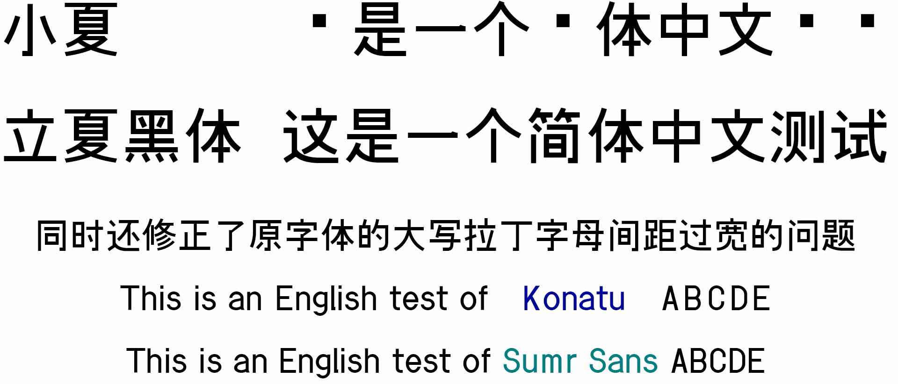

# 立夏黑体 Sumr Sans
一个基于 [小夏字体](https://www.masuseki.com/wp/?p=233) 增补汉字的黑体。使用 [zi2zi-JiT](https://github.com/kaonashi-tyc/zi2zi-JiT) 训练其风格，以 [文渊黑体、文渊宋体](https://github.com/takushun-wu/WenYuanFonts) 为结构参考字体,进行补字。

目前已覆盖绝大部分 GB2312、现代汉语常用字表、现代汉语通用字表、义务教育语文课程常用字表、通用规范汉字表、[落霞孤鹜 外字初步整理表（第一部分）](https://github.com/lxgw/ext-characters/blob/main/tables/ext_characters_table_1.md)、[绵饴字集](https://www.maoken.com/eyes/business/27905.html) 和 [NAF194](https://github.com/Hansha2011/NAF/blob/main/NAF194.md)。

注意事项：
1. 程序生成出来的是 256 像素的 png 图片，矢量化后字体会有边缘不够平滑、点数太多的问题。
2. 其中一些复杂的不常用字由于程序一直生成不出来，没有被收录。
3. 程序生成的字体会有不协调的问题。
4. 虽然已经人工检查，但可能还是会有部分字有错误（少比划之类的）。
5. 目前版本仅为补字，之后会慢慢修改字形使其符合内地、港台的标准。
6. 如有发现问题请在 [Issues](https://github.com/feiyangjun-1/kirakara-round/issues) 提出。

本字体使用 OFL 协议，可免费商用、随意修改等。
